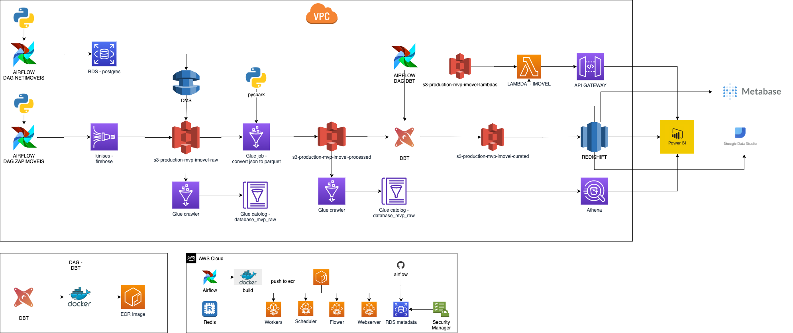

# Data Lake Imóvel

Esse projeto tem o objetivo de precificar  imóveis de acordo com os dados geográficos, características do imóvel e oferta, usando algoritmos de predição.

O Data Lake foi estruturado na Aws, usando os seguintes serviços:

# IAC ( Infraestrutura como Código )
Cloudformation
Github
GitAction

# Storage
S3

# Catalog
Glue crawler

# DataWhareHouse

DMS
Kinesses Firehouse
IAM

Glue Job
Glue Database
Athena
Redshift Spectrum
RDS Postgres
EMR
ECS
ECR

Airflow
Python
Docker

Secret Manager

